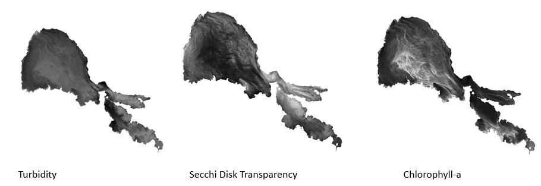

# Sen2-eutrophication-parameters
This python script uses Sentinel-2 products (L2A) to display the spatial distribution of three
relevant indicators of eutrophication: [1]: chlorophyll-a, [2]: turbidity, [3]: secchi disk transparency.



Feel free to open a pull request to add a new eutrophication algorithm to the script.

## Dependencies

In order to run this script you need to have the following dependencies installed on your local machine:
- numpy and osgeo (gdal, osr), matplotlib

## Usage

```shell
python -W ignore main.py in="c:\Users\<your_username>\Desktop\data" shape="c:\Users\<your_username>\Desktop\lake_shape.shp" statistics plot
```
  * `in=` path to the sentinel-2 data folder
  * if you'd like to clip your region with a polygon then reference the path to your shapefile `shape=` (shape and satellite data must have the same crs)
  * `statistics` add this flag if the mean, min, max, variance and standard deviation should be calculated
  * `plot` add this flag to create a subplot with the three water quality parameter
  * `-W ignore` to ignore numpys "RuntimeWarning: divide by zero encountered" error message

### Folder structure

Make sure your data folder contains only the Sentinel-2 data with the original folder structure. The `processed` folder will be 
created by the script.  

```
data
└───S2A_MSIL2A_20200217T190441_N0214_R013_T10SEJ_20200217T230414.SAFE
└───S2A_MSIL2A_20200414T184921_N0214_R113_T10SEJ_20200414T230546.SAFE
└───S2B_MSIL2A_20200618T184919_N0214_R113_T10SEJ_20200618T224552.SAFE
└───processed
```

The path to the image data should be as follows `GRANULE -> L2... -> IMG_DATA`.

## Literature

- [1]: Grendaite et al., 2018. Chlorophyll-a concentration retrieval in eutrophic lakes in Lithuania from Sentinel-2 data. Geologija. Geografija 4 (1), 15-28.
- [2]: Esri, 2021. River Turbidity Estimation using Sentinel-2 data, https://developers.arcgis.com/python/sample-notebooks/river-turbidity-estimation-using-sentinel2-data-/
- [3]: Delegido et al., 2019. Turbidity and Secchi disc depth with Sentinel-2 in different trophic status reservoirs at the 
Comunidad Valenciana
